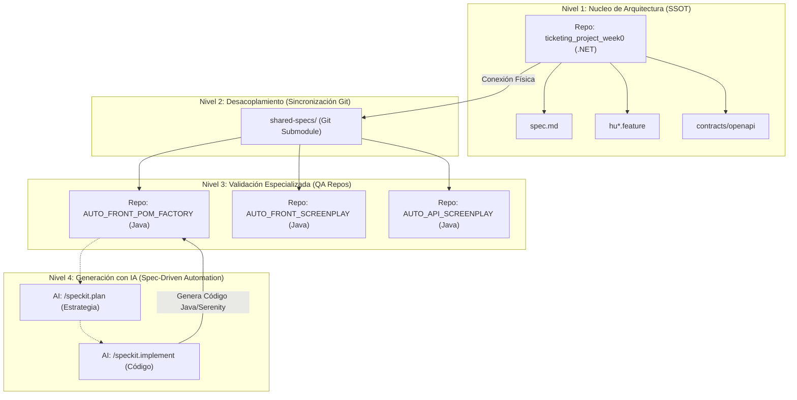

# AI Workflow — Registro del flujo de trabajo con IA

Fecha: 2026-02-26

Resumen
- Este documento registra el flujo de trabajo con IA usado para generar los artefactos del proyecto `001-ticketing-mvp` (Spec, Plan, Tasks) usando el framework Spec Kit / speckit.
- Contiene los prompts finales utilizados, referencias a los archivos generados y cómo se verificó cada paso.

Framework utilizado
- Speckit / Spec Kit (comandos utilizados: `/speckit.constitution`, `/speckit.specify`, `/speckit.plan`, `/speckit.tasks`, `/speckit.implement`).

Artefactos generados
- `specs/001-ticketing-mvp/spec.md` — Especificación del MVP.
- `specs/001-ticketing-mvp/plan.md` — Plan técnico accionable.
- `specs/001-ticketing-mvp/tasks.md` — Lista de tareas con checkboxes.

## 🛠️ Adaptaciones y Decisiones Críticas del Equipo

### Personalización de Speckit
Durante la fase de implementación, se tomaron decisiones de personalización sobre las herramientas de automatización de Spec Kit (scripts `.sh` de Speckit/GitHub):

- **Modificación de Scripts de Git:** Se editaron los archivos `.sh` (como `phase-1-smoke-test.sh` y otros scripts de automatización interna de speckit) para permitir convenciones de nomenclatura de ramas y estructuras de commits personalizadas.
- **Filosofía del Desarrollador (Jostin):** Se estableció que, aunque se utilicen frameworks de trabajo guiado por IA o metodologías como *Spec Driven Development*, el equipo debe **priorizar las convenciones internas del equipo de desarrollo** por encima de las restricciones rígidas del framework. 
- **Resultado:** El flujo de trabajo es ahora "Spec-Driven" pero adaptado al lenguaje y cultura del equipo, permitiendo commits automáticos y nombres de ramas que reflejen mejor el contexto del proyecto real más allá del boilerplate del framework.

### Estrategia Multi-Repositorio y Trazabilidad con IA (Actualización 2026-03-16)

Para escalar la automatización bajo estándares industriales de QA, hemos implementado una **Estructura Desacoplada basada en la Fuente de Verdad (SSOT)**. 

#### 🧩 Arquitectura del Workflow con IA



#### 🛡️ Pilares de la Integración con IA
1. **Contexto Alimentado por el Negocio:** La IA en los repositorios de QA (Java) no inventa casos de prueba; los genera analizando el archivo `shared-specs/specs/001-ticketing-mvp/spec.md` clonado del repo principal.
2. **Trazabilidad de Cambios:** Cualquier modificación en las reglas de negocio se registra en el `CHANGELOG.md` del repositorio de arquitectura, permitiendo que la IA detecte discrepancias y actualice los scripts de prueba automáticamente.
3. **Multi-Patrón Asistido:** Se utiliza la IA para diferenciar la implementación técnica:
   - **POM + Factory:** Estructura clásica de clases y objetos.
   - **Screenplay:** Estructura centrada en Actores, Tareas y Preguntas.
4. **Validación de Contratos:** Los tests de API generados por la IA se validan contra los archivos YAML/OpenAPI presentes en el submódulo, asegurando que la automatización siempre esté sincronizada con el backend.

**Repositorios Relacionados:**
- UI (POM + Factory): [AUTO_FRONT_POM_FACTORY](https://github.com/JostinAlvaradoS/AUTO_FRONT_POM_FACTORY)
- UI (Screenplay): [AUTO_FRONT_SCREENPLAY](https://github.com/JostinAlvaradoS/AUTO_FRONT_SCREENPLAY)
- API (Screenplay REST): [AUTO_API_SCREENPLAY](https://github.com/JostinAlvaradoS/AUTO_API_SCREENPLAY)

Referencias (archivos en el repo)
- [spec.md](specs/001-ticketing-mvp/spec.md)
- [plan.md](specs/001-ticketing-mvp/plan.md)
- [tasks.md](specs/001-ticketing-mvp/tasks.md)

Prompts finales usados (versión ratificada)

1) Constitución — comando: `/speckit.constitution`

Prompt final (v1.1.0):

```
Este proyecto es un sistema distribuido de venta de boletos para eventos usando microservicios .NET con arquitectura hexagonal.

Principios obligatorios:
- Arquitectura: Hexagonal (Ports & Adapters) estricta en cada microservicio. Domain puro, sin dependencias de infraestructura.
- Base de datos: UNA instancia PostgreSQL compartida con schemas por bounded context (bc_identity, bc_catalog, bc_inventory, etc.).
- Comunicación: Sincrónica HTTP/REST (Minimal APIs) + gRPC opcional; asíncrona con Kafka para eventos y eventual consistency.
- Transacciones: Priorizar locales ACID; evitar sagas complejas al inicio.
- Redis: Obligatorio para locks distribuidos y TTL de reservas temporales.
- Observability: Logs estructurados (Serilog), traces y métricas con OpenTelemetry.
- Despliegue local: Docker Compose con 1 postgres + redis + kafka + zookeeper + servicios .NET.
- Calidad: Unit tests con mocks de puertos; integration con Testcontainers (single Postgres).
- Tech stack base: .NET 9+, EF Core + Npgsql, Confluent.Kafka, MediatR, FluentValidation, Serilog + OTEL.
- Configuración: Uso de valores por defecto en `appsettings.json` y `docker-compose.yml`, omitiendo `.env` para facilitar el intercambio de código entre pares (Contexto Training).
- Seguridad: JWT desde Identity Service, rate limiting, secrets via .env/User Secrets (Omitido intencionalmente según decisión de equipo).
```

2) Especificación — comando: `/speckit.specify`

Prompt final (enfocado en MVP + flujo P1):

```
Construye la especificación completa para un sistema distribuido de venta de boletos para eventos (ticketing platform) con microservicios .NET, arquitectura hexagonal y una sola PostgreSQL compartida (schemas por bounded context), siguiendo estrictamente la constitution.md v1.1.0 ratificada.

Enfócate en hacer un MVP viable con el flujo principal de compra de boletos como prioridad absoluta.

Estructura la especificación siguiendo el template estándar de Spec Kit:
- Overview
- User Stories (priorizadas P1-P3, cada una independiente y testable; usa formato "As a ... I want ... so that ...")
- Acceptance Scenarios (Given-When-Then para cada story)
- Edge Cases
- Functional Requirements (FR-001, FR-002...)
- Key Entities (con atributos principales, sin implementación)
- Success Criteria (medibles)
- Non-Functional Requirements (NFR-...)
- Key Flows (textuales, paso a paso para el flujo principal)
- Assumptions & Clarifications Needed
- Contracts & Artifacts
- Acceptance Test Plan (high level)
- Next Steps

Dominios / Microservicios principales: Identity/Auth, Catalog, Inventory (reservas con Redis TTL), Ordering/Cart, Payment (simulado), Fulfillment (PDF/QR), Notification.

Requisitos clave para MVP:
- Flujo P1: Seleccionar asiento → reservar temporal (15 min) → agregar a carrito → pago simulado → generar boleto + QR → notificación email.
- Concurrencia: optimistic locking en Postgres + Redis locks.
- Estados básicos: Seat (available/reserved/sold), Reservation (active/expired/cancelled), Order (draft/pending/paid/fulfilled/cancelled).
- Kafka para eventos: reservation-created, payment-succeeded, payment-failed, ticket-issued, reservation-expired.

Genera un archivo spec.md claro, conciso y accionable, listo para pasar a /speckit.plan.
```

3) Plan técnico — comando: `/speckit.plan`

Prompt final:

```
Genera el plan técnico completo para el MVP de la Ticketing Platform, basado estrictamente en:
- constitution.md v1.1.0 (hexagonal estricta, shared PostgreSQL con schemas bc_*, Kafka asíncrono, Redis locks, Docker Compose simple, transacciones locales primero).
- spec.md en specs/001-ticketing-mvp/spec.md (MVP enfocado en flujo P1: reserva → carrito → pago simulado → boleto QR + notificación).

Estructura el plan siguiendo el template estándar de Spec Kit:
- Tech Stack Detallado
- Estructura de Proyecto y Carpetas Hexagonal por Microservicio
- PostgreSQL Schemas y Configuración
- Redis Usage
- Kafka Topics y Schemas Iniciales
- Docker Compose Outline
- Concurrency & Locking Strategy
- Domain Events y Choreography
- Observability Setup
- Security Baseline
- Priorización de Fases y Tareas Iniciales
- Risks & Mitigations

Mantén el plan accionable, realista para MVP y alineado con simplicidad (simulado payment, no Stripe aún; PDFs generados y referenciados en DB).
Genera un archivo plan.md claro y listo para pasar a /speckit.tasks.
```

4) Tareas (tasks.md) — comando: `/speckit.tasks`

Prompt final:

```
Genera la lista de tareas accionables para implementar el MVP según el plan.md en specs/001-ticketing-mvp/plan.md y spec.md.

- Usa formato Markdown con checkboxes: - [ ] T### Descripción (Prioridad Px, Est: Yh) [Dependencias: Txxx]
- Agrupa por fases del plan: Phase 0 (Foundation), Phase 1 (Core), Phase 2 (Payment/Fulfillment), Phase 3 (Polish)
- Prioriza infra y foundational tasks primero (docker-compose, schemas, migrations, Identity skeleton)
- Incluye tareas de tests (unit + integration con Testcontainers)
- Marca dependencias
- Incluye tareas para contratos (OpenAPI + Kafka schemas iniciales)
- Mantén tareas pequeñas y secuenciales

Genera tasks.md listo para marcar progreso [x] a medida que implementemos con /speckit.implement.
```

5) Implementación (comando: `/speckit.implement "T### – descripción"`)

Prompt base (plantilla usada para cada implementación):

```
Implementa la tarea TXXX del tasks.md: "[pega descripción completa de la tarea]"

- Sigue estrictamente constitution.md v1.1.0 y plan.md (arquitectura hexagonal, schemas bc_*, etc.).
- Crea los archivos necesarios en la estructura correcta (services/<service>/src/Domain, Application, Infrastructure, Api).
- Incluye unit tests básicos si aplica.
- Usa .NET 9+ y paquetes recomendados (EF Core, MediatR, etc.).
- Genera código completo y funcional para esta tarea específica.
- Al final, muestra los archivos creados y cómo probarlos (ej: dotnet run, curl, etc.).
```

6) Nuevas Funcionalidades (Admin CRUD) con TDD — comando: `/speckit.tdd_feature`

Prompt final (v1.0.0):

```
Re-elabora el plan de tareas para integrar una fase de CRUD Administración (Eventos y Asientos) en el servicio Catalog, utilizando un enfoque estrictamente TDD (Test-Driven Development) y lenguaje Gherkin.

Requerimientos para la fase:
- Especificación: Crear un archivo .feature con escenarios Gherkin (Given-When-Then) para el flujo de Admin.
- Ciclo TDD: Red-Green-Refactor como base de implementación.
- Prioridad: Event creation, bulk seat generation, soft-delete.
- Pruebas: Unit tests para dominios (Event, Seat) y tests de integración para casos de uso (Mediatr Handlers) usando Testcontainers.

Tareas a generar:
- Definición de Gherkin (.feature).
- Implementación de Unit Tests de Dominio antes que la lógica.
- Implementación de Command Handlers guiados por Unit Tests.
- Setup de Integration Tests con Testcontainers para validar la persistencia en el schema bc_catalog.
- Implementación de API Endpoints con validación de roles (Admin).
```

7) Estrategia DevOps de Pruebas con Enfoque Shift Left — comando: `/qa-devops-shift-left`

**Contexto:**
Basándose en la experiencia de pruebas unitarias, de integración, smoke e2e ya implementadas en el proyecto (archivos de configuración y scripts: `docker-smoke-test.sh`, `system-e2e-test.sh`, `migrate-all-test.sh`, `TEST_PLAN.md`, `TESTING_STRATEGY.md`), se define ahora un flujo DevOps completo que integre análisis estático (SonarQube), análisis de vulnerabilidades (Trivy) y pruebas funcionales/no funcionales bajo un enfoque **Shift Left** (pruebas desde la izquierda del pipeline = lo antes posible en desarrollo).

**Prompt final refinado (v1.0.0):**

```
Como experto en QA Senior, diseña un flujo DevOps completo que integre las pruebas unitarias, de integración, smoke e2e existentes bajo un enfoque Shift Left. Implementa un pipeline CI/CD que incluya pruebas funcionales y no funcionales (análisis de vulnerabilidades con Trivy, análisis de calidad de código con SonarQube) en cada etapa. 

El pipeline debe progresionalmente:
1. Ejecutar pruebas unitarias de caja blanca (unit tests en paralelo por servicio).
2. Realizar pruebas de integración y análisis estático de código (SonarQube).
3. Ejecutar análisis de vulnerabilidades (Trivy sobre imágenes Docker y dependencias).
4. Ejecutar pruebas e2e de caja negra (smoke tests + system e2e).
5. Validar garantías de seguridad y rendimiento (métricas de cobertura, deuda técnica).

Requisitos:
- Automatización completa en GitHub Actions o similar (CI/CD).
- Reportes generados para cobertura, vulnerabilidades y calidad de código.
- Fallos en etapas críticas deben bloquear progresión (ej: vulnerabilidades críticas, cobertura < 70%).
- Integración con artefactos existentes: docker-compose.yml, scripts de test (docker-smoke-test.sh, system-e2e-test.sh, etc.).
- Logs estructurados y trazabilidad de cada ejecución.
```

**Objetivos principales:**
- **Caja blanca → Caja negra:** Comenzar con pruebas de unitarias enfocadas en lógica de negocio y dominios, evolucionar hacia pruebas de integración e2e que validen comportamiento desde la perspectiva del usuario.
- **Early detection:** Detectar problemas de calidad, seguridad y funcionalidad tan pronto como sea posible en el ciclo de desarrollo.
- **Calidad sostenible:** Mantener métricas de cobertura, deuda técnica y vulnerabilidades bajo control continuo.

**Artefactos esperados:**
- Pipeline CI/CD documentado (GitHub Actions workflow YAML).
- Configuración de SonarQube (sonarcloud.io o self-hosted).
- Configuración de Trivy (scan de imágenes y dependencias).
- Dashboard de calidad y seguridad (métricas por servicio).
- Reporte consolidado de pruebas (cobertura, smoke, e2e, vulnerabilidades).

**Referencias internas (ya existentes):**
- [TESTING_STRATEGY.md](TESTING_STRATEGY.md) — Estrategia global de testing.
- [TEST_PLAN.md](TEST_PLAN.md) — Plan detallado de pruebas.
- [TDD_report.md](TDD_report.md) — Registro de pruebas ATDD.
- [docker-smoke-test.sh](docker-smoke-test.sh), [system-e2e-test.sh](system-e2e-test.sh), [migrate-all-test.sh](migrate-all-test.sh) — Scripts de automatización.

Verificación y evidencia de avance
- Cada artefacto generado (`spec.md`, `plan.md`, `tasks.md`) se diseñó para ser testable y transferible a la fase de implementación.
- La verificación se planificó contra los Acceptance Scenarios en `spec.md` y contra las tareas en `tasks.md` (checkboxes).
- Para implementaciones se requiere: unit tests + integration tests con Testcontainers; los eventos críticos se validan con topics Kafka y con DB state en schemas `bc_*`.

Notas y decisiones clave
- Se siguió la `constitution` v1.1.0 como single source of truth para decisiones arquitectónicas.
- Prioridad absoluta: flujo P1 (reserva → pago simulado → ticket + QR).
- Pago simulado para acelerar MVP; integración real con proveedores queda para fases posteriores.

Próximos pasos sugeridos
- Ejecutar `/speckit.implement` para las tareas prioritarias en `tasks.md` (ej. T001 docker-compose, T002 schemas/migrations, T010 Identity skeleton).
- Añadir evidencias de implementación (links a commits/PRs y resultados de tests) en este documento conforme avance el desarrollo.

Registro de cambios
- 2026-02-26: Creación inicial de `AI_WORKFLOW.MD` con prompts y referencias.
