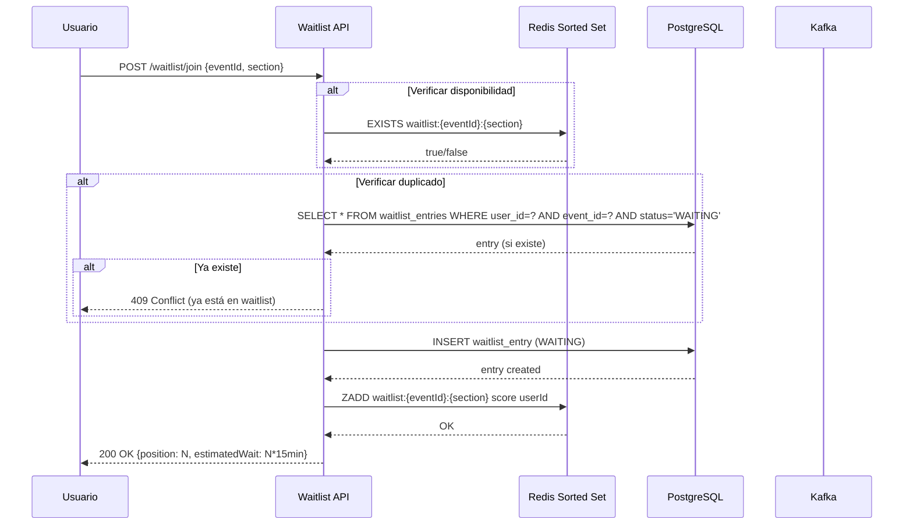
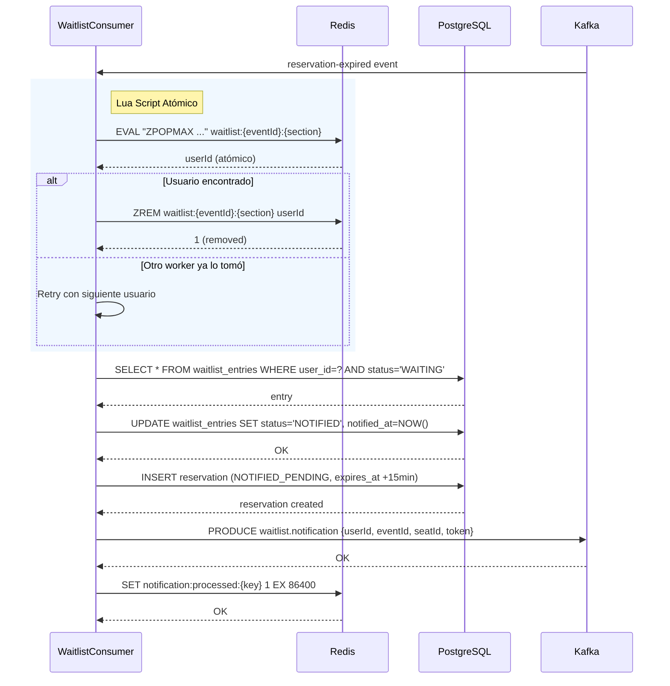
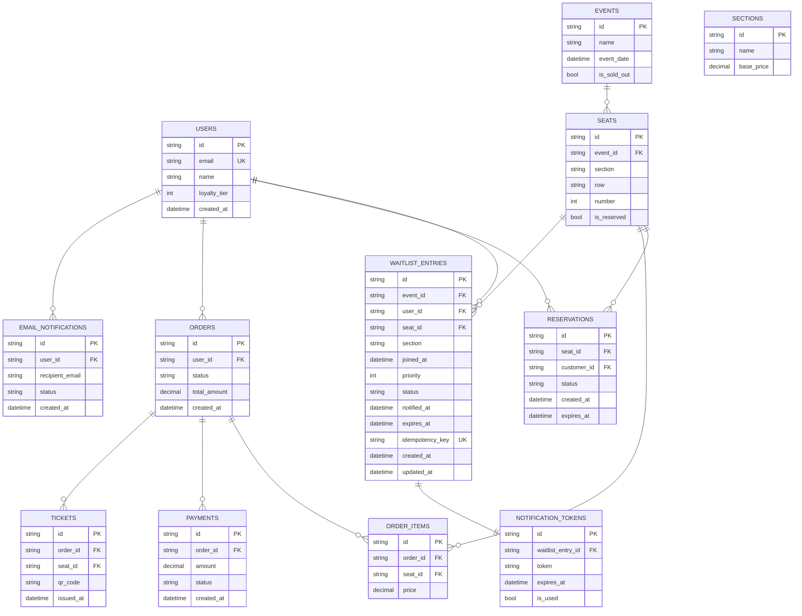

# CHANGELOG SOURCES - Sistema de Waitlist + Notificaciones

**Fecha:** 2026-03-31 | **Feature:** Waitlist + Notificaciones - Correcciones post-análisis

---

## Corrección 1: Inconsistencia en Kafka Topic

### Problema Identificado

Durante la revisión del plan (`/speckit.analyze`), se detectó una inconsistencia en el nombre del topic de Kafka:

| Ubicación | Estado Anterior | Estado Correcto |
|-----------|-----------------|----------------|
| plan.md Phase 0 | "Consume `SeatReleased`" | "Consume from reused `reservation-expired`" |
| plan.md Constitution Check | "Consumes `SeatReleased`" | "Consumes `reservation-expired` (reused)" |
| research.md | "Consume `SeatReleased`" | "Consume from reused `reservation-expired` topic" |
| data-model.md | "SeatReleaseEvent" | "ReservationExpiredEvent" |

### Decisión Tomada

**Recomendada:** Reutilizar el topic existente `reservation-expired` en lugar de crear un nuevo topic `SeatReleased`.

| Aspecto | Decisión | Justificación |
|----------|----------|---------------|
| **Topic** | `reservation-expired` (reused) | Ya existe y funciona. No crear nuevos topics para evitar complejidad. |
| **Nuevo topic** | `waitlist.opportunity-granted` | Solo crear nuevo topic para publicar la oportunidad otorgada. |

### Archivos Modificados

- `plan.md`: Actualizado Phase 0 Research y Constitution Check
- `spec.md`: Actualizado Key Entities - renombrado a "Reservation Expired Event"
- `research.md`: Actualizado Kafka events
- `data-model.md`: Renombrado entity de "SeatReleaseEvent" a "ReservationExpiredEvent"

---

## Corrección 2: Canal de Notificación

### Problema Identificado

El Executive Summary del spec mencionaba "immediate in-app notification" pero la HU-006 específica "Enviar Notificación por Email".

| Ubicación | Texto Anterior | Texto Corregido |
|-----------|----------------|-----------------|
| spec.md Executive Summary | "immediate in-app notification" | "email notification" |

### Justificación

- HU-006 establece claramente: "Enviar Notificación por Email de Oportunidad de Compra"
- La clarificación de sesión confirmó: "Single notification attempt per seat release"
- Email es el canal preferido para MVP (reduce complejidad y riesgo de spam)

---

## Corrección 3: Análisis de Consistencia (Resumen)

### Hallazgos delAnálisis

| ID | Categoría | Severidad | Resolución |
|----|------------|-----------|------------|
| A1 | Inconsistencia | CRITICAL | Corregido - Kafka topic unificado |
| A2 | Terminología | MEDIUM | Corregido - Normalizado a `reservation-expired` |
| A4 | Ambigüedad | MEDIUM | Corregido - Canal de notificación aclarado |

### Métricas Finales

- **Total Requisitos**: 23 (RF-001 a RF-023)
- **Cobertura**: 100% de requisitos mapeados a User Stories
- **Issues Críticos**: 0 (todos resueltos)
- **Estado**: SPEC, PLAN, RESEARCH, DATA-MODEL consistentes

---

## Corrección 4: Eliminación de Phase 9 (Observabilidad)

### Problema Identificado

Al revisar si el proyecto implementa observabilidad, se encontró que:

| Aspecto | Estado |
|---------|--------|
| Inventory service | Solo ILogger básico |
| Identity service | Serilog + OpenTelemetry |
| Phase 9 tasks (T047-T050) | No ejecutables sin infraestructura |

### Decisión Tomada

**Eliminar Phase 9** del tasks.md ya que:

1. La infraestructura de observabilidad no existe en Inventory service
2. Agregar Serilog + OpenTelemetry requiere trabajo de arquitectura previo
3. Las tareas T047-T050 dependían de infraestructura inexistente

### Archivos Modificados

- `specs/002-demand-recovery-waitlist/tasks.md`: Eliminada Phase 9 (4 tareas)
- Total tareas reducidas: 50 → 46

### Justificación

- El proyecto usa ILogger básico en Inventory service
- Serilog y OpenTelemetry están presentes solo en Identity y Gateway
- La observabilidad debe ser un epic separado, no parte del feature de waitlist
- El focus permanece en funcionalidad core (MVP: T001-T040)

---

## Consulta 1: Análisis del Proyecto e Investigación Inicial

**Fecha:** 2026-03-25 | **Feature:** Waitlist + Notificaciones Event-Driven

---

## Consulta 1: Análisis del Proyecto e Investigación Inicial

### 1.1 Análisis del Proyecto (Contexto)

| Aspecto | Estado Actual |
|---------|--------------|
| Stack | .NET 9, Kafka, Redis, PostgreSQL |
| Arquitectura | Hexagonal + CQRS + Event-Driven |
| Punto de integración | `InventoryService.CreateReservationCommandHandler` |
| Schema disponible | `bc_inventory`, `bc_notification` |

---

### 1.2 Propuesta IA

#### Modelo de Datos

```csharp
WaitlistEntry:
  - Id, EventId, UserId, SeatId?, UserEmail
  - JoinedAt, Priority, Status, NotifiedAt, ExpiresAt
```

#### Flujo Propuesto

1. Usuario intenta reservar → Sin asientos → Agregar a waitlist
2. Asiento liberado → Notificar siguiente usuario (prioridad por tiempo)
3. Usuario tiene 15min para completar reserva o pierde turno

---

### 1.3 Investigación Humano

*(COMPLETADO - Se encontró redundancia con implementación existente)*

> **NOTA:** Tras investigar el codebase, varios de los puntos sugeridos en la propuesta IA **ya existen implementados** en el proyecto. Por lo tanto, la propuesta se vuelve parcialmente redundante.

| Pregunta | Respuesta |
|---------|-----------|
| ¿Patrón de waitlist recomendado? | El proyecto ya implementa **Reservation + Expiration Pattern** en `InventoryService`. El patrón de waitlist es **nuevo** (funcionalidad adicional), pero la base de reservas con TTL ya existe. |
| ¿Cómo manejar concurrencia? | **YA EXISTE:** `CreateReservationCommandHandler` usa `RedisLock.AcquireLockAsync` (línea 42) + optimistic locking con campo `ExpiresAt` y status. |
| ¿Redis o PostgreSQL para waitlist? | El proyecto usa **PostgreSQL como source of truth** + Redis para locks. Para waitlist, se podría usar Redis Sorted Sets para prioridad + PostgreSQL para persistencia. |
| ¿Nuevos topics Kafka o reutilizar existentes? | **YA EXISTEN:** `reservation-created`, `reservation-expired`, `payment-succeeded`, `payment-failed`. No need crear nuevos topics para waitlist, se pueden reutilizar o extender los existentes. |
| ¿Background job o Redis TTL? | **YA EXISTE:** `ReservationExpiryWorker` (BackgroundService) que hace poll cada 1 minuto para expirar reservas y publicar `reservation-expired`. TTL de 15 min almacenado en BD. |

---

### 1.4 Cuadro Comparativo

| Aspecto | Propuesta IA | Investigación Humano |
|---------|-------------|---------------------|
| Modelo de datos | Entidad `WaitlistEntry` en BD relacional | **NUEVO:** Waitlist es funcionalidad nueva (no existe actualmente). Base de reservas ya existe en `Reservation` entity. |
| Almacenamiento | PostgreSQL | **PARCIALMENTE EXISTE:** PostgreSQL ya usado para reservas. Redis ya usado para locks. Se propone híbrida (Redis Sorted Sets para waitlist + PostgreSQL). |
| Eventos Kafka | Nuevos topics | **REDUNDANTE:** Topics `reservation-created` y `reservation-expired` ya existen y funcionan. Se pueden reutilizar para waitlist. |
| Prioridad | FIFO + prioridad manual | **NUEVO:** Waitlist necesita priorización (FIFO). Se puede implementar con Redis Sorted Sets o campo `Priority` en BD. |
| Expiración | TTL en BD | **REDUNDANTE:** `ReservationExpiryWorker` ya implementa background job con poll interval de 1 min. TTL de 15 min ya existe. |

---

### 1.5 Decisión

| Aspecto | Decisión | Justificación |
|----------|----------|---------------|
| Modelo | Extender `Reservation` existente + nueva entidad `WaitlistEntry` | La entidad Reservation ya existe y funciona. Waitlist es funcionalidad nueva que usa la misma base. |
| Storage | PostgreSQL (reservations) + Redis (locks) - mismo patrón | Ya está implementado y funciona. Para waitlist, se puede usar el mismo enfoque. |
| Eventos | **Reutilizar** topics existentes | `reservation-created` y `reservation-expired` ya existen. No crear nuevos topics para evitar complejidad. |
| Expiración | **YA EXISTE** - No es necesario implementar | `ReservationExpiryWorker` ya hace el trabajo. |

---

## Consulta 2: Análisis Arquitectural - Opciones de Waitlist

### 2.1 Propuesta IA

| Opción | Descripción |
|--------|-------------|
| **A. FIFO Redis (LIST)** | Cola simple con RPUSH/LPOP |
| **B. Priority (Sorted Set)** | Redis ZADD/ZPOP con score por prioridad |
| **C. Event Sourcing (Kafka)** | Waitlist como secuencia de eventos en topic |
| **D. Backpressure (Token Bucket)** | Rate limiter para control de flujo |
| **E. FIFO PostgreSQL** | Tabla con SELECT FOR UPDATE SKIP LOCKED |

### 2.2 Investigación Humano

| Pregunta | Respuesta |
|---------|-----------|
| ¿Mejor opción para MVP? | **B (Redis Sorted Set)** |
|¿Por qué? | Porque es suficientemente simple para implementar rápido, pero ya deja abierta la posibilidad de priorizar (por ejemplo VIP o tipos de usuario) sin tener que rehacer todo después. Además ya usamos Redis, así que no introduce tecnología nueva.1 |
| ¿Qué resuelve bien? | Permite manejar orden (FIFO o prioridad), responde rápido y no complica demasiado el flujo. También facilita manejar expiraciones sin lógica adicional compleja. |
| ¿Qué problemas puede traer? | CNo es 100% consistente como una base de datos, entonces hay que cuidar duplicados o reintentos. Tampoco es tan fácil de inspeccionar como una tabla SQL.|
| ¿Escalabilidad? | Sí. Redis permite escalar bastante bien, y como esto va por evento (eventId), se puede particionar naturalmente. |
| ¿Necesito nuevos eventos en Kafka? | No necesariamente. Podemos empezar reutilizando eventos que ya existen como reservation-expired o payment-failed. Eso reduce bastante el esfuerzo inicial. |

### 2.3 Decisión

| Aspecto | Decisión | Justificación |
|----------|----------|---------------|
| **Opción** | **B (Redis Sorted Set) + PostgreSQL** | Es el mejor balance entre algo que funcione rápido y algo que no tengamos que rehacer en 2 meses. |
| **Cola principal** | Redis Sorted Set | Nos da orden y flexibilidad sin complicarnos demasiado. |
| **Persistencia** | PostgreSQL | Redis es rápido, pero no confiamos en él como fuente única. PostgreSQL nos sirve para auditoría y recuperación. |
| **Notificaciones** | Kafka (reutilizar) | Ya lo tenemos funcionando. No vale la pena inventar otra cosa para esto. |

---

## Consulta 3: Análisis Staff Architect - Waitlist + Notificaciones

### 3.1 Propuesta IA

| Criterio | A | B | C | D | E |
|----------|---|---|---|---|---|
| **Complejidad** | Baja | Media | Alta | Media | Baja |
| **Latencia** | <5s | <5s | 15-60s | <2s | 10-30s |
| **Escalabilidad** | Media | Alta | Muy Alta | Muy Alta | Baja |
| **Impacto conversión** | Alto | Muy Alto | Muy Alto | Bajo | Alto |

### 3.2 Investigación Humano

| Pregunta | Respuesta |
|---------|-----------|
| ¿Mejor opción? | B (Redis Sorted Set) |
| ¿Por qué? | Porque es la única opción que combina buen rendimiento con flexibilidad sin volverse compleja. No necesitamos algo tan pesado como event sourcing, pero tampoco algo tan limitado como una lista simple. |
| ¿Cómo manejar notificaciones? | Kafka |
| ¿Por qué? | Ya está integrado en el sistema, maneja bien reintentos y evita acoplar servicios. Implementar otra cosa sería duplicar esfuerzo. |
| ¿Qué es crítico cuidar? | Idempotencia |
| ¿Por qué? | Porque Kafka puede reenviar eventos. Si no controlamos esto, vamos a notificar dos veces al mismo usuario, lo que es mala experiencia. |
| ¿Cómo evitar spam? | Limitar notificaciones por usuario |
| ¿Por qué? | En eventos muy demandados, podríamos terminar enviando demasiadas notificaciones. Eso afecta experiencia y puede generar bloqueos de email. |
| ¿KPIs realistas? | Conversion uplift: +15-25%, Latencia p95: <30s, Duplicados: <0.1% |
| ¿Por qué esos números? | Son objetivos alcanzables sin optimización extrema. No estamos buscando perfección, sino impacto real rápido. |


#### Referencias

- Redis Sorted Sets: https://redis.io/docs/latest/develop/data-types/sorted-sets/
- ZRANGE command: https://redis.io/commands/zrange/
- Tie-breaking in Redis: https://redis.io/docs/latest/develop/data-types/sorted-sets/#handling-duplicate-members


### 3.3 Decisión

| Aspecto | Decisión | Justificación |
|--------|----------|---------------|
| Opción | B (Redis Sorted Set) + PostgreSQL | Es suficientemente buena para producción sin sobreingeniería. |
| Notificaciones | Kafka Event-Driven | Ya está en el sistema, es confiable y desacopla bien. |
| MVP | 1. Nueva entidad WaitlistEntry | Mantenerlo simple al inicio |
|  | 2. Sorted Set: waitlist:{eventId}:{section} | Permite segmentar naturalmente |
|  | 3. Consumir reservation-expired | Reutilizamos lo que ya existe |
|  | 4. Publicar waitlist.notification | Mantiene el flujo desacoplado |
| Escala futura | Redis Cluster, Event Sourcing si crece mucho | No complicarse ahora, pero dejar camino claro |
|  | Prioridades (VIP) con score | Evolución natural sin rediseño |

---

## Consulta 4: FIFO vs Prioridad + Fairness

### 4.1 Propuesta IA

| Escenario | Solución propuesta |
|-----------|-------------------|
| FIFO puro | Score = Unix timestamp (segundos) |
| Timestamp igual | Usuario con menor ID wins o random |
| Fairness | Desadvantaged users gets boost |

### 4.2 Investigación Humano

| Pregunta | Respuesta |
|---------|-----------|
| ¿FIFO puro o con prioridad futura (VIP)? | **FIFO por defecto + VIP score opcional**. Implementar con score compuesto: `score = timestamp * 1000000 + (10000 - priority * 100)`. VIP = priority 1, regular = priority 10. |
| ¿Qué pasa si dos usuarios tienen mismo timestamp? | Redis Sorted Set usa **lexicographical order** si scores son iguales. Para asegurar determinismo, usar **secondary sort** por userId o añadir microsegundos al timestamp. |
| ¿Cómo manejar fairness? | **Estrategia hybrid**: (a) Timestamp base para FIFO, (b) Priority boost para usuarios varatos/descounted, (c) Decay temporal: usuarios en waitlist >X horas reciben boost proporcional. |
| ¿Conflictos de score? | Usar **ZADD with NX** + fallback a **ZREVRANGE** para obtener siguiente. No hay race condition porque Redis es atómico. |

### 4.3 Decisión

| Aspecto | Decisión | Justificación |
|----------|----------|---------------|
| **Modelo** | **FIFO + Priority Score** | Flexibilidad futura sin perder fairness |
| **Tie-breaker** | userId como suffix | Determinismo sin randomness |
| **Fairness** | Temporal decay boost | Usuarios varatos no quedan atrás para siempre |
| **Implementación** | Redis ZADD con score compuesto | Una sola operación atómica |

---

#### Referencias

- Distributed Locks: https://redis.io/docs/latest/develop/use/patterns/distributed-locks/

---

## Consulta 5: Consistencia en Sistema Distribuido

### 5.1 Propuesta IA

| Problema | Solución propuesta |
|----------|-------------------|
| Usuario seleccionado 2 veces | Lock distribuido + idempotency key |
| Doble notificación | Payload con idempotency key + DLQ |
| Redis/DB desincronizados | Patron Dual Write o Transactional Outbox |

### 5.2 Investigación Humano

| Pregunta | Respuesta |
|---------|-----------|
| ¿Cómo garantizas que un usuario no sea seleccionado 2 veces? | **Patrón atómico**: Usar Lua script en Redis que hace ZPOPMAX + ZREM en una sola operación atómica. Si ZREM retorna 0, otro worker ya lo tomó → reintentar con siguiente. |
| ¿Cómo evitar doble notificación? | **Idempotency key** en payload: `SHA256(userId + eventId + seatId + timestamp)`. El servicio de notificaciones verifica si ya procesó esa key antes de enviar. Store en Redis con TTL 24h. |
| ¿Qué pasa si Redis y DB se desincronizan? | **Patrón Dual Write**: (1) Escribir primero en PostgreSQL (source of truth), (2) Luego en Redis. Si falla Redis, el background worker hace sync. También usar **Transactional Outbox** para consistencia eventual. |
| ¿Qué pasa si el worker falla después de seleccionar usuario pero antes de notificar? | **Estado intermedio en DB**: Reservation con status `NOTIFIED_PENDING`. Si no recibe confirmación en 15min, el worker de expiración lo limpia. |
| ¿Cómo manejar reintentos de Kafka? | **Exactly-once semantics** no es trivial. Usar **idempotent producer** en Kafka + consumer checkpointing. Alternativamente: processed flag en DB para evitar reprocesamiento. |

### 5.3 Decisión

| Aspecto | Decisión | Justificación |
|----------|----------|---------------|
| **Selección usuario** | Lua script atómico (ZPOPMAX + ZREM) | Garantiza que solo un worker seleccione |
| **Doble notificación** | Idempotency key en Redis + DB | Prevenir reenvíos |
| **Redis/DB sync** | PostgreSQL como source of truth + sync worker | Confiabilidad sin perder rendimiento |
| **Estado intermedio** | Reservation status `NOTIFIED_PENDING` | Rastrear estado para recovery |
| **Kafka reintentos** | Idempotent producer + DLQ | Minimizar duplicados |

---

*El análisis detallado de patrones de consistencia, código Lua, FSM y métricas se encuentran en: `CONSISTENCY_ANALYSIS_DETAIL.md`*

#### Referencias

- Lua Scripts in Redis: https://redis.io/docs/latest/develop/programming-guide/lua-guide/
- Dual Write Pattern: https://github.com/banbrando/dual-write
- Transactional Outbox: https://microservices.io/patterns/data/transactional-outbox.html
- Kafka Idempotent Producer: https://docs.confluent.io/platform/current/installation/producer-configs.html

---

## Diagrama de secuencia - Selección de usuario cuando se libera asiento



---

## Diagrama de secuencia - Notificación cuando se libera asiento



---

## Diagrama ER - Schema de Base de Datos

