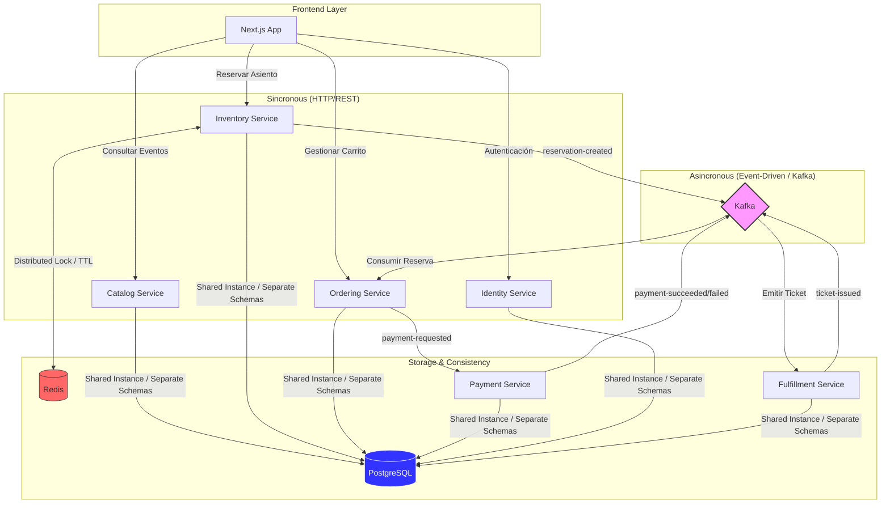

# 🎫 SpecKit Ticketing Platform

[](https://en.wikipedia.org/wiki/Hexagonal_architecture_(software))
[]()


Plataforma distribuida de venta de boletos para eventos diseñada bajo **Arquitectura Hexagonal**, **CQRS** y un enfoque **Event-Driven**. El sistema garantiza consistencia y alta disponibilidad mediante el uso de locks distribuidos y mensajería asíncrona.

---

## 🏛️ Arquitectura y Comunicación

El sistema se basa en microservicios independientes que se comunican de forma híbrida: **REST** para operaciones síncronas de lectura/acción inmediata y **Kafka** para la coreografía de procesos de larga duración (Pago, Reserva, Emisión).



---

## 🛠️ Stack Tecnológico

| Componente | Tecnología |
| :--- | :--- |
| **Backend** | .NET 9, MediatR, EF Core, Minimal APIs |
| **Frontend** | Next.js 14 (App Router), TailwindCSS, Shadcn/UI |
| **Mensajería** | Apache Kafka |
| **Cache & Lock** | Redis |
| **Base de Datos** | PostgreSQL (Schemas: `bc_catalog`, `bc_inventory`, etc.) |
| **Observabilidad** | OpenTelemetry, Serilog |

---

## 🚀 Inicio Rápido

### 1. Levantar Infraestructura (Backend)
Desde la raíz del repositorio, inicia los contenedores esenciales (Postgres, Redis, Kafka, Microservicios):
```bash
cd infra
docker compose up -d
```

> [!IMPORTANT]
> **Configuración Simplificada (Contexto de Entrenamiento):** Este proyecto **NO utiliza archivos `.env`** ni secretos externos. Todas las configuraciones necesarias están pre-cargadas en `docker-compose.yml` y `appsettings.json` para facilitar las revisiones de pares y permitir un levantamiento inmediato sin intercambio manual de archivos.

### 2. Levantar Frontend
En una nueva terminal, instala las dependencias e inicia el servidor de desarrollo:
```bash
cd frontend
npm install
npm run dev
```

El sistema estará disponible en `http://localhost:3000`.

---

## 📂 Documentación del Proyecto

| Documento | Descripción |
| :--- | :--- |
| [AI Workflow](AI_WORKFLOW.MD) | Registro de prompts y flujo con IA. |
| [Human Checks](humanchcks.md) | Registro de decisiones técnicas y correcciones a la IA. |
| [Technical Debt](deptReport.md) | Reporte de puntos de mejora y arquitectura. |
| [TDD Report](TDD_report.md) | Seguimiento de pruebas bajo enfoque **ATDD**. |
| [API Guide](FRONTEND_API_GUIDE.md) | Guía de integración para el Frontend. |

---

## ✅ Estados de Tarea y Progreso
El seguimiento detallado se encuentra en [specs/001-ticketing-mvp/tasks.md](specs/001-ticketing-mvp/tasks.md). El equipo utiliza **ATDD** para las funcionalidades pendientes, asegurando que cada tarea cumpla con los criterios de aceptación antes de su integración.

