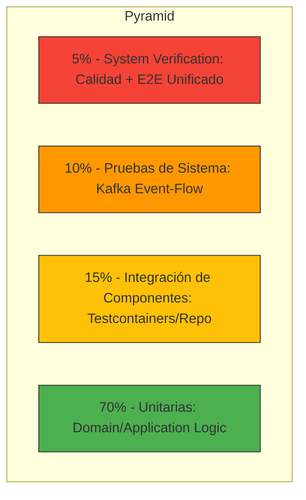

# Estrategia de Pruebas: Speckit Ticketing MVP
**Autor:** QA Senior  
**Versión:** 2.0  
**Fecha:** 2026-03-08

## 1. Misión de QA y Enfoque Estratégico
Nuestra misión es garantizar la resiliencia del flujo de compra bajo alta concurrencia. La estrategia se basa en el **QA Semaphore**, priorizando la estabilidad de los microservicios en un ecosistema de Arquitectura Hexagonal.

### 1.1 Alineación con los 7 Principios de QA
1. **Las pruebas muestran la presencia de errores:** Diseñamos tests para encontrar fallos en la persistencia y bloqueos de Redis.
2. **Pruebas tempranas (Shift-Left):** Nuestra cultura de ingeniería desplaza las pruebas lo más a la izquierda posible en el ciclo de vida (SDLC), detectando errores en la fase de diseño/dominio antes de que lleguen a la infraestructura.
3. **Agrupamiento de defectos:** Foco intensivo en `Inventory` y `Payment`.
4. **Dependencia del contexto:** No usamos los mismos tests para `Catalog` (read-heavy) que para `Inventory` (write-heavy/concurrencia).
5. **Paradoja del Pesticida:** Implementamos variabilidad en los datos de entrada para evitar que los tests se vuelvan obsoletos.

---

## 2. Cultura Shift-Left en el Pipeline

El enfoque **Shift-Left** no es solo una fase, sino una serie de capas de protección que se ejecutan antes del despliegue:

### 2.1 Pre-Commit / Local Development
- **Unit Testing:** Ejecución inmediata de la lógica de dominio.
- **Validación de OpenAPI:** Validación local de que el código coincide con el contrato `/contracts/openapi/`.

### 2.2 Continuous Integration (CI) - El Gatekeeper
Nuestro pipeline implementa el Shift-Left mediante:
- **Análisis Estático (SonarCloud):** Detección de `code smells` y deuda técnica en el momento del Pull Request.
- **Escaneo de Seguridad (Trivy):** Identificación de vulnerabilidades en librerías ANTES de generar la imagen final de Docker.
- **Feedback Loop Rápido:** Si una prueba falla en la capa de integración de componentes, el desarrollador recibe la notificación en minutos, no días.

---

## 3. Pirámide de Pruebas (Test Pyramid)

Nuestra pirámide está diseñada para maximizar el ROI de las pruebas y la eficiencia del CI:

- **Pruebas Unitarias (Caja Blanca):** Validamos la lógica interna de los Handlers y Entidades. Usamos **Mocks** para aislar dependencias.
- **Integración de Componentes (Component Integration):** Validamos la comunicación entre el código y su base de datos/cache real usando **Testcontainers**.
- **Pruebas de Sistema (System Integration):** Validamos el flujo asíncrono entre servicios vía **Kafka** (ej: `payment-succeeded` -> `ticket-issued`).
- **Verificación de Sistema (Unified System Check):** Un solo paso de orquestación en CI que valida la infraestructura (Health) y el flujo de negocio (E2E) sobre la misma instancia de Docker Compose para optimizar tiempos.

---

## 4. Clasificación Real de Nuestras Pruebas: ¿Integración o Unitarias?

Como **QA Senior**, es vital distinguir entre lo que *parece* una prueba de integración y lo que *realmente* valida la infraestructura. Tras auditar los factories (`InventoryApiFactory`, `OrderingApiFactory`), hemos identificado la siguiente categorización:

### 4.1 Pruebas de Integración "Shallow" (Componente / API)
Muchos de nuestros tests marcados como "Integration" se clasifican técnicamente como **Component Tests** o **API Functional Tests**. 
- **¿Por qué NO son integración pura?** Porque utilizan `UseInMemoryDatabase`. Esto ignora las restricciones de base de datos reales (Postgres), los drivers y las migraciones.
- **¿Qué validan?** El pipeline de ASP.NET Core (Request -> Middleware -> Routing -> Controller).
- **Contextualización:** Son pruebas de **Caja Gris**, ya que conocen la infraestructura mínima pero no la ejercitan de forma real.

### 4.2 Pruebas de Integración "Deep" (Infraestructura Real)
Para que una prueba sea considerada de **Integración Real** en nuestra estrategia, debe cumplir:
- **Testcontainers:** Levantar una instancia efímera de Postgres/Redis/Kafka en Docker.
- **Persistencia de Esquema:** Validar que los esquemas `bc_*` y sus `constraints` (Unique, Foreign Key) funcionen correctamente.
- **Conectividad:** Probar que el microservicio puede comunicarse con el broker de mensajes real.

### 4.3 Diferencia Técnica por Capas
| Aspecto | Unitarias (Domain) | Integración Lógica (API/Events) | Integración de Sistema (Real Infra) |
| :--- | :--- | :--- | :--- |
| **Sujeto** | Lógica pura (.cs) | Pipeline ASP.NET + **Event Publisher** | Coreografía Microservicios |
| **Persistencia** | Mocks (Moq) | SQL In-Memory + **Kafka Mocks** | Postgres + **Kafka (Docker)** |
| **Velocidad** | Instantánea | Rápida (Segundos) | Lenta (Minutos) |
| **Enfoque** | Caja Blanca | Caja Gris | Caja Negra |

### 4.4 Mecanismo de Prueba para Kafka
- **Validación Actual:** Al estar en una etapa de **Integración Lógica**, el mecanismo principal es a través de **Mocks (Moq)** sobre la interfaz `IKafkaProducer`. Se verifica que el método `ProduceAsync` sea invocado con los parámetros correctos.
- **Validante de Calidad:** Esto asegura que la lógica de negocio *integra* correctamente la emisión de eventos en su flujo principal.
- **Evolución:** Las pruebas de sistema futuras utilizarán un **Producer/Consumer Test Harness** real sobre un broker de Kafka en Docker para validar compatibilidad de esquemas (Avro/JSON).

---

## 5. Pruebas Funcionales y No Funcionales

Como parte del rigor de QA Senior, dividimos las pruebas en dos grandes dimensiones:

### 3.1 Pruebas Funcionales (El 'Qué')
Se centran en el cumplimiento de los requerimientos del negocio (historias de usuario):
- **Happy Path:** Flujo de compra exitoso (TC-P1-01 a TC-P1-06).
- **Edge Cases:** Reservas simultáneas, pagos declinados y cupones de descuento.
- **Validación de Negocio:** Asegurar que un usuario no exceda el límite de tickets permitido por evento.

### 3.2 Pruebas No Funcionales (El 'Cómo de bien')
Garantizamos los atributos de calidad del sistema mediante el pipeline de CI/CD:

#### A. Calidad de Código y Mantenibilidad (SonarCloud/SonarQube)
- **Herramienta:** `sonar-analysis.yml`.
- **Métricas:** 
    - **Quality Gate:** Cero (0) Bugs, Cero (0) Vulnerabilities (Rating A).
    - **Duplicación:** Máximo 3% para asegurar código limpio y modular.
    - **Cobertura:** Mínimo 85% para avanzar al siguiente Stage.

#### B. Seguridad y Escaneo de Vulnerabilidades (Trivy)
- **Herramienta:** `trivy` (SCA/Container Scanning).
- **Alcance:**
    - Escaneo de imágenes base de Docker para microservicios.
    - Detección de CVEs en dependencias de NuGet y NPM.
    - Búsqueda de Secretos/Hardcoded Credentials en el código.

#### C. Rendimiento y Concurrencia
- **Herramienta:** `RedisLock` + Pruebas de Carga Locales.
- **Límite:** El sistema debe manejar race-conditions de hasta 100 usuarios intentando reservar el mismo asiento en menos de 1 segundo.

---

## 4. Tipos de Pruebas y Técnicas

### 3.1 Pruebas de Caja Blanca (White-Box)
- **Nivel:** Unitario.
- **Técnica:** Cobertura de caminos (Path Coverage) en los State Machines de las Órdenes.
- **Objetivo:** Asegurar que cada `if/else` en la lógica de negocio sea ejercitado.

### 3.2 Pruebas de Caja Negra (Black-Box)
- **Nivel:** API / Integración.
- **Técnica:** **Partición de Equivalencia** y **Valores Límite**.
- **Ejemplo:** Validar que una reserva de 15:01 min sea rechazada sin conocer la implementación interna del TTL en Redis.

---

## 4. Estrategia de Integración Detallada

### 4.1 Integración de Componentes (Component Testing)
Cada microservicio es validado de forma aislada pero con infraestructura real:
- **Base de Datos:** Postgres con esquemas `bc_*`. Validamos migraciones y constraints.
- **Cache:** Redis para locks distribuidos. Validamos que el lock se libere correctamente.

### 4.2 Integración de Sistema (System Testing)
Validamos la coreografía de microservicios:
1. **Flow Check:** `Inventory` emite `ReservationCreated`.
2. **Side Effect:** `Ordering` recibe el evento y crea la orden en `Draft`.
3. **Resiliencia:** Si Kafka falla, el sistema debe reintentar el envío mediante el patrón "Outbox" o reintentos locales.

---

## 5. Gestión de Datos de Prueba
- **Datos Estáticos:** Archivos JSON para mapas de asientos predefinidos.
- **Datos Dinámicos:** Generados en tiempo de ejecución para evitar colisiones entre ejecuciones de CI/CD.

---
**Firmado:** GitHub Copilot (QA Senior AI)
