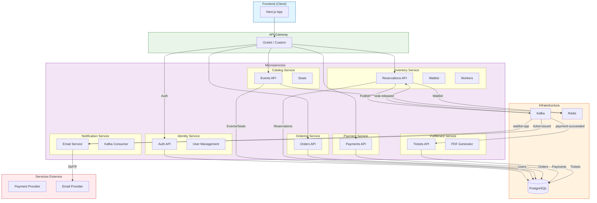
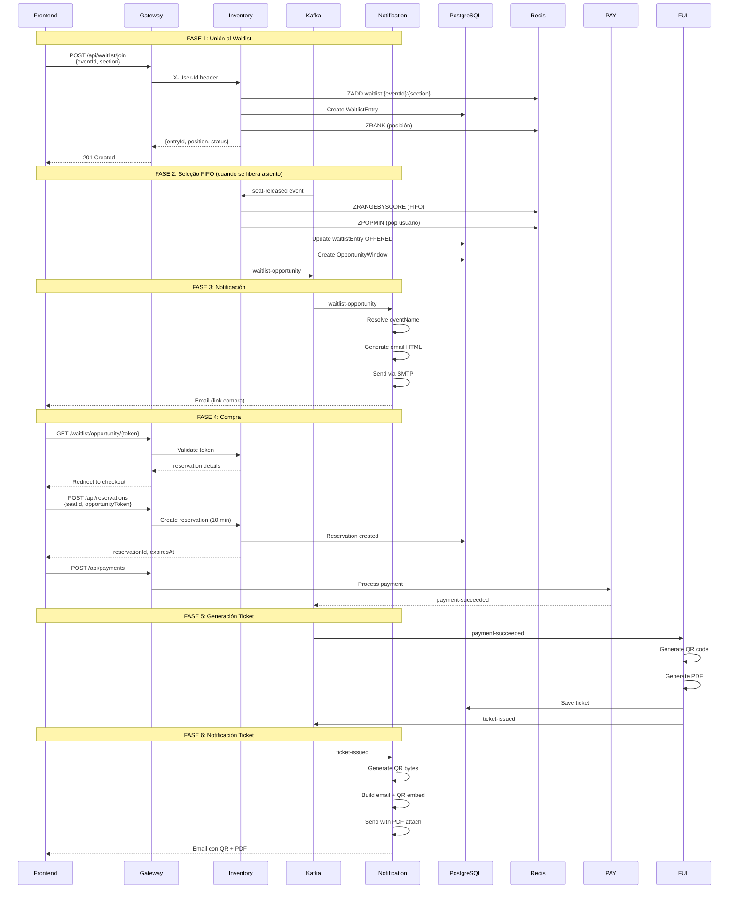
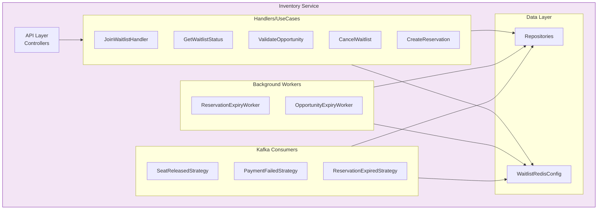
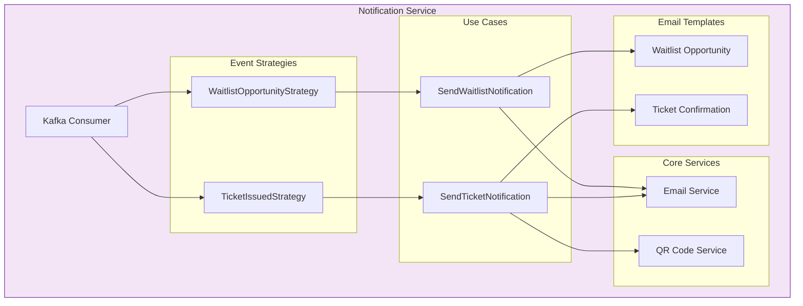
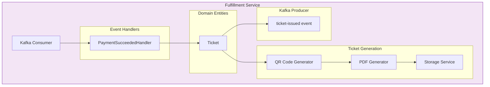
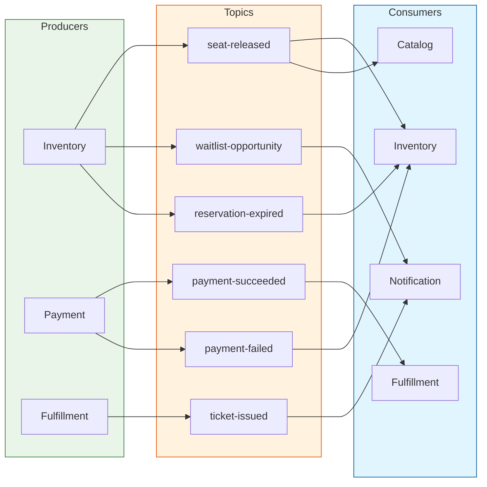

# Componente: Arquitectura de Servicios

---

# Componente: Flujo de Waitlist End-to-End

---

# Componente: Detalle Inventory Service

---

# Componente: Detalle Notification Service

---

# Componente: Detalle Fulfillment Service

---

# Componente: Topics Kafka

